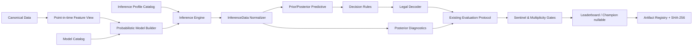

# Batch PPL-01 基本設計書

**名称**: 確率的プログラミング・ベイズ時系列フルモデル拡張  
**対象**: `loto_forecast_platform` v3.2.0  
**状態**: `PROPOSED / BASIC_DESIGN_COMPLETE`  
**作成日**: 2026-08-03  
**入力アーカイブ SHA-256**: `a4508dea6b054cf8c3a409fd7c0544ca202cb8cb0fd6e6f2ee820c8c0ce57049`

---

## 1. 文書の目的

本書は、現行の機械学習・統計・深層学習・時系列基盤モデルに加えて、確率的プログラミングおよびベイズ推論モデルを**最小構成ではなく、全方式を選択実行・比較・監査できる有界なフル構成**として追加するための基本設計を定義する。

ここでいう「全モデル」は、世界中の全確率モデルを無制限に列挙する意味ではない。本プロジェクトで意味のあるモデルを、共役モデル、階層モデル、回帰、状態空間、レジーム切替、混合・ノンパラメトリック、深層確率モデル、校正・アンサンブル・意思決定まで含めて機械可読カタログ化した範囲を指す。

### 1.1 設計目標

1. 現行174モデルを壊さず、追加モデルを同じカタログ・ライフサイクル・評価基盤へ接続する。
2. 点予測だけでなく、事後分布、予測分布、信用区間、校正、モデル不確実性を保存する。
3. 全モデルを試せるが、モデル×推論器の無制限直積は避け、互換行列と計算量上限で有界化する。
4. 8ワーカー構成を維持しつつ、単一GPUの同時実行数と重いMCMCのCPU同時数を安全に制限する。
5. 短期上振れ、固定値化、リーク、選択バイアス、非収束を正式な失敗状態として検出する。
6. PyMC、NumPyro、Pyro、CmdStanPyを主経路とし、BlackJAXを推論バックエンド、TensorFlow Probabilityを隔離実験経路として扱う。

## 2. 現行リポジトリの確認結果

アップロードされたソースから次を確認した。

| 項目 | 現状 |
|---|---:|
| 現行フルモデルカタログ | **174** |
| 基本モデルカタログ | 89 |
| Pythonソース | 638ファイル |
| pytestテスト | 107ファイル |
| 対応ゲーム | mini / loto6 / loto7 / bingo5 / numbers3 / numbers4 |
| Python制約 | `>=3.11,<3.14` |
| 現行バージョン | `3.2.0` |

既存基盤には、`GameGeometry`、`protocol_hash`、点時点結合、負の対照、Romano-Wolf/Holm系多重比較、holdout封印、昇格判定、成果物SHA-256、単一整合性マニフェストがある。確率モデル拡張はこれらを再実装せず利用する。

## 3. 追加規模

値は付属の機械可読カタログから生成する。

| 区分 | 件数 |
|---|---:|
| 既存モデル | 174 |
| 追加確率モデル定義 | 72 |
| 統合後の目標モデル件数 | **246** |
| 推論プロファイル | **29** |

### 3.1 追加モデルのファミリー別件数

| ファミリー | 件数 |
| --- | --- |
| bayesian_regression | 5 |
| calibration | 3 |
| changepoint | 2 |
| conjugate | 8 |
| count | 8 |
| decision | 3 |
| deep_probabilistic | 10 |
| dynamic_conjugate | 1 |
| empirical_bayes | 1 |
| ensemble | 3 |
| gaussian_process | 2 |
| hierarchical | 2 |
| mixture | 3 |
| nonparametric | 5 |
| ordinal | 3 |
| regime_switching | 4 |
| semi_parametric | 2 |
| state_space | 6 |
| tree_bayesian | 1 |

## 4. スコープ

### 4.1 実装対象

- 共役・経験ベイズ型カテゴリ分布
- 階層Dirichlet・部分プーリング
- ベイズ多項ロジット、順序回帰、縮小事前分布
- Bayesian GAM、BART、Gaussian Process分類
- 動的Dirichlet、ロジスティック正規状態空間
- 単一・複数変化点
- HMM、HSMM、切替動的モデル
- Poisson、Negative Binomial、zero-inflated、hurdle、Beta-Binomial
- 有限混合、Dirichlet Process、HDP、sticky HDP-HMM
- Bayesian MLP/TCN/GRU/LSTM/Transformer、Deep Markov Model
- Bayesian model averaging、PSIS-LOO stacking、動的モデル平均
- Bayesian calibration
- Hit@±1およびMSEを用いる事後効用最大化
- 法的範囲・重複禁止・昇順制約を満たす事後制約デコーダ

### 4.2 非目標

- 予測不能な乱数に存在しない信号を生成すること
- MCMCの信用区間を予測可能性の証明として扱うこと
- holdoutを用いた事前分布・窓幅・モデル構造の選択
- 全72モデル×全29推論プロファイルの無条件総当たり
- 収束していない事後分布からのランキング
- runtime certificationをaccuracy certificationとして扱うこと

## 5. 基本アーキテクチャ



### 5.1 設計上の分離

| レイヤー | 責務 |
|---|---|
| Model definition | 尤度、事前分布、階層、潜在状態を定義 |
| Inference profile | NUTS、SMC、SVI、Pathfinder等の実行条件 |
| Backend adapter | PyMC/NumPyro/Pyro/Stan/TFP差異を吸収 |
| InferenceData normalizer | 全バックエンドを共通のxarray/ArviZ形式へ変換 |
| Diagnostic gate | R-hat、ESS、divergence、tree depth、ELBO等を判定 |
| Posterior decision | Hit@±1、MSE、確率校正に整合する予測値を選択 |
| Existing evaluation | rolling、holdout、sentinel、multiplicity、promotion |

## 6. 配置予定

```text
src/loto/probabilistic/
├── __init__.py
├── contracts.py
├── catalog.py
├── compatibility.py
├── model_builder.py
├── inference_engine.py
├── inference_data.py
├── diagnostics.py
├── predictive.py
├── decision.py
├── priors.py
├── likelihoods.py
├── state_space.py
├── mixtures.py
├── calibration.py
├── ensemble.py
├── artifact_store.py
├── resources.py
├── backends/
│   ├── base.py
│   ├── pymc_adapter.py
│   ├── numpyro_adapter.py
│   ├── pyro_adapter.py
│   ├── cmdstanpy_adapter.py
│   ├── blackjax_adapter.py
│   └── tfp_adapter.py
└── models/
    ├── conjugate.py
    ├── hierarchical.py
    ├── regression.py
    ├── dynamic.py
    ├── counts.py
    ├── mixtures.py
    ├── deep.py
    └── meta.py

configs/probabilistic/
├── catalog.yaml
├── inference_profiles.yaml
├── compatibility.yaml
├── priors/
├── smoke.yaml
├── standard.yaml
├── full.yaml
└── exhaustive.yaml

stan/
├── shared/
└── models/

tests/probabilistic/
├── unit/
├── simulation_recovery/
├── cross_backend/
├── leakage/
├── integration/
└── runtime_certification/
```

## 7. 共通インターフェース

```python
class ProbabilisticModelAdapter(ModelAdapter):
    def build_model(self, data, geometry, config): ...
    def fit(self, data): ...
    def sample_prior_predictive(self): ...
    def sample_posterior(self): ...
    def sample_posterior_predictive(self, future_data): ...
    def predict_distribution(self, future_data): ...
    def diagnose(self): ...
    def save(self, path): ...
    def load(self, path): ...
```

### 7.1 必須出力契約

- `candidate_probability_mean`
- `candidate_probability_sd`
- `candidate_probability_hdi_low/high`
- `posterior_predictive_samples`
- `point_prediction_raw`
- `point_prediction_decoded`
- `decision_rule_id`
- `inference_profile_id`
- `protocol_hash`
- `data_version`
- `feature_set_hash`
- `prior_spec_hash`
- `model_graph_hash`
- `diagnostic_status`
- `backend_version`
- `random_seed`

## 8. モデルカタログ

以下は本バッチで実装対象とする全モデル定義である。詳細は`probabilistic_model_catalog.yaml`を正とし、本表はそこから生成した。

| model_id | family | role | likelihood | backends | flags | priority |
| --- | --- | --- | --- | --- | --- | --- |
| pp-uniform-dirichlet | conjugate | control | Categorical | builtin, pymc, numpyro, stan | - | p0 |
| pp-static-dirichlet-categorical | conjugate | baseline | Categorical | builtin, pymc, numpyro, stan | - | p0 |
| pp-expanding-dirichlet-categorical | conjugate | baseline | Categorical | builtin, pymc, numpyro, stan | - | p0 |
| pp-rolling-dirichlet-categorical | conjugate | candidate | Categorical | builtin, pymc, numpyro, stan | - | p0 |
| pp-discounted-dirichlet-categorical | conjugate | candidate | Categorical | builtin, pymc, numpyro | 動的 | p0 |
| pp-empirical-bayes-dirichlet | empirical_bayes | candidate | Categorical | pymc, numpyro, stan | - | p0 |
| pp-dirichlet-multinomial | conjugate | candidate | DirichletMultinomial | pymc, numpyro, stan | - | p1 |
| pp-beta-binomial-position | conjugate | candidate | BetaBinomial | pymc, numpyro, stan | - | p1 |
| pp-beta-binomial-candidate | conjugate | candidate | BetaBinomial | pymc, numpyro, stan | - | p1 |
| pp-hierarchical-dirichlet-digits | hierarchical | candidate | Categorical | pymc, numpyro, stan, pyro | 階層 | p0 |
| pp-hierarchical-dirichlet-games | hierarchical | candidate | Categorical | pymc, numpyro, stan, pyro | 階層 | p1 |
| pp-multinomial-logit-normal | bayesian_regression | candidate | Categorical | pymc, numpyro, stan, pyro | 外生 | p0 |
| pp-multinomial-logit-laplace | bayesian_regression | candidate | Categorical | pymc, numpyro, stan, pyro | 外生 | p1 |
| pp-multinomial-logit-horseshoe | bayesian_regression | candidate | Categorical | pymc, numpyro, stan | 外生 | p1 |
| pp-multinomial-logit-regularized-horseshoe | bayesian_regression | candidate | Categorical | pymc, numpyro, stan | 外生 | p1 |
| pp-multinomial-probit | bayesian_regression | research | Categorical | pymc, numpyro, stan | 外生, 実験 | p2 |
| pp-ordinal-cumulative-logit | ordinal | candidate | OrderedLogistic | pymc, numpyro, stan | 外生 | p0 |
| pp-ordinal-adjacent-category | ordinal | candidate | Categorical | pymc, numpyro, stan | 外生 | p1 |
| pp-ordinal-continuation-ratio | ordinal | candidate | Bernoulli sequence | pymc, numpyro, stan | 外生 | p1 |
| pp-bayesian-spline-categorical | semi_parametric | candidate | Categorical | pymc, numpyro, stan | 外生 | p1 |
| pp-bayesian-gam-categorical | semi_parametric | candidate | Categorical | pymc, numpyro, stan | 外生 | p1 |
| pp-bart-categorical | tree_bayesian | candidate | Categorical/Bernoulli | pymc_bart | 外生 | p1 |
| pp-gp-categorical | gaussian_process | research | Categorical | pymc, numpyro, pyro, tfp | 外生, 実験 | p2 |
| pp-dynamic-dirichlet-discount | dynamic_conjugate | candidate | Categorical | pymc, numpyro, stan | 動的 | p0 |
| pp-logistic-normal-random-walk | state_space | candidate | Categorical | pymc, numpyro, stan, pyro | 動的 | p0 |
| pp-local-level-categorical | state_space | candidate | Categorical | pymc, numpyro, stan, pyro | 動的 | p1 |
| pp-local-linear-trend-categorical | state_space | candidate | Categorical | pymc, numpyro, stan, pyro | 動的 | p1 |
| pp-dynamic-regression-categorical | state_space | candidate | Categorical | pymc, numpyro, stan, pyro | 外生, 動的 | p1 |
| pp-dynamic-horseshoe-categorical | state_space | research | Categorical | pymc, numpyro, stan | 外生, 動的, 実験 | p2 |
| pp-single-changepoint-categorical | changepoint | candidate | Categorical | pymc, numpyro, pyro | 動的 | p1 |
| pp-multiple-changepoint-categorical | changepoint | research | Categorical | pymc, numpyro, pyro | 動的, 実験 | p2 |
| pp-hmm-categorical | regime_switching | candidate | Categorical | pymc, numpyro, stan, pyro | 動的 | p1 |
| pp-hsmm-categorical | regime_switching | research | Categorical | pyro, numpyro | 動的, 実験 | p2 |
| pp-switching-logistic-normal | regime_switching | research | Categorical | pyro, numpyro | 動的, 実験 | p2 |
| pp-switching-dynamic-regression | regime_switching | research | Categorical | pyro, numpyro | 外生, 動的, 実験 | p2 |
| pp-seasonal-harmonic-categorical | state_space | research | Categorical | pymc, numpyro, stan, pyro | 外生, 動的, 実験 | p2 |
| pp-gaussian-process-time-varying-logit | gaussian_process | research | Categorical | pymc, numpyro, pyro, tfp | 動的, 実験 | p2 |
| pp-poisson-candidate-count | count | candidate | Poisson | pymc, numpyro, stan, pyro | 外生 | p1 |
| pp-negative-binomial-candidate-count | count | candidate | NegativeBinomial | pymc, numpyro, stan, pyro | 外生 | p1 |
| pp-zero-inflated-poisson-count | count | research | ZeroInflatedPoisson | pymc, numpyro, pyro | 外生, 実験 | p2 |
| pp-zero-inflated-negative-binomial-count | count | research | ZeroInflatedNegativeBinomial | pymc, numpyro, pyro | 外生, 実験 | p2 |
| pp-beta-binomial-overdispersed | count | candidate | BetaBinomial | pymc, numpyro, stan | 外生 | p1 |
| pp-multinomial-logistic-normal-count | count | candidate | Multinomial | pymc, numpyro, stan | 外生 | p1 |
| pp-poisson-lognormal-count | count | research | Poisson | pymc, numpyro, stan, pyro | 外生, 階層, 実験 | p2 |
| pp-hurdle-count | count | research | HurdlePoisson/HurdleNB | pymc, numpyro, pyro | 外生, 実験 | p2 |
| pp-finite-mixture-categorical | mixture | research | Categorical | pymc, numpyro, stan, pyro | 実験 | p2 |
| pp-mixture-of-experts-categorical | mixture | research | Categorical | pymc, numpyro, pyro | 外生, 実験 | p2 |
| pp-latent-class-categorical | mixture | research | Categorical | pymc, numpyro, stan, pyro | 実験 | p2 |
| pp-dirichlet-process-categorical | nonparametric | research | Categorical | pymc, numpyro, pyro | 実験 | p2 |
| pp-hierarchical-dirichlet-process | nonparametric | research | Categorical | pyro, numpyro | 階層, 実験 | p2 |
| pp-sticky-hdp-hmm | nonparametric | research | Categorical | pyro, numpyro | 動的, 実験 | p2 |
| pp-dp-changepoint | nonparametric | research | Categorical | pyro, numpyro | 動的, 実験 | p2 |
| pp-bayesian-kernel-mixture | nonparametric | research | Categorical | pymc, numpyro, pyro | 実験 | p2 |
| pp-bayesian-mlp | deep_probabilistic | research | Categorical | pyro, tfp | 外生, 実験 | p2 |
| pp-bayesian-tcn | deep_probabilistic | research | Categorical | pyro, tfp | 外生, 動的, 実験 | p2 |
| pp-bayesian-gru | deep_probabilistic | research | Categorical | pyro, tfp | 外生, 動的, 実験 | p2 |
| pp-bayesian-lstm | deep_probabilistic | research | Categorical | pyro, tfp | 外生, 動的, 実験 | p2 |
| pp-bayesian-transformer | deep_probabilistic | research | Categorical | pyro, tfp | 外生, 動的, 実験 | p2 |
| pp-variational-rnn | deep_probabilistic | research | Categorical | pyro | 外生, 動的, 実験 | p2 |
| pp-deep-markov-model | deep_probabilistic | research | Categorical | pyro | 外生, 動的, 実験 | p2 |
| pp-neural-hmm | deep_probabilistic | research | Categorical | pyro, numpyro | 外生, 動的, 実験 | p2 |
| pp-bayesian-embedding-categorical | deep_probabilistic | research | Categorical | pyro, tfp | 外生, 実験 | p2 |
| pp-bayesian-neural-ordinal | deep_probabilistic | research | OrderedLogistic | pyro, tfp | 外生, 実験 | p2 |
| pp-bayesian-model-averaging | ensemble | meta | Posterior mixture | pymc, numpyro, stan | - | p1 |
| pp-psis-loo-stacking | ensemble | meta | Predictive mixture | arviz | - | p0 |
| pp-dynamic-model-averaging | ensemble | meta | Predictive mixture | pymc, numpyro, stan | 動的 | p1 |
| pp-bayesian-beta-calibration | calibration | meta | Bernoulli | pymc, numpyro, stan | - | p1 |
| pp-bayesian-dirichlet-calibration | calibration | meta | Categorical | pymc, numpyro, stan | - | p0 |
| pp-bayesian-temperature-calibration | calibration | meta | Categorical | pymc, numpyro, stan | - | p1 |
| pp-posterior-utility-hit1 | decision | meta | Posterior predictive | builtin | - | p0 |
| pp-posterior-utility-hit1-mse | decision | meta | Posterior predictive | builtin | - | p0 |
| pp-posterior-constrained-decoder | decision | meta | Posterior predictive | builtin | - | p0 |

## 9. 推論プロファイル

PyMCはNUTSを含むMCMC、離散変数用Gibbs/Metropolis、SMC、ADVI、およびNumPyro/BlackJAX NUTS経路を持つ。NumPyroはJAXによるNUTS/HMCとSVI、離散潜在変数向け推論を提供する。PyroはSVIを中心にMCMC、SMC、深層モデルとの統合を提供する。CmdStanPyはNUTS-HMC、Pathfinder、ADVI、MAPをファイルベースで実行できる。BlackJAXはNUTS、SMC、Pathfinder等のアルゴリズム層として使用する。

| profile_id | backend | algorithm | tier | latent | default |
| --- | --- | --- | --- | --- | --- |
| pymc-nuts | pymc | NUTS | confirmatory | 連続のみ | {"chains": 4, "draws": 1000, "tune": 1000, "target_accept": 0.9} |
| pymc-hmc | pymc | HMC | research | 連続のみ | {"chains": 4, "draws": 1000, "tune": 1000} |
| pymc-categorical-gibbs | pymc | CategoricalGibbsMetropolis | discrete | 離散可 | {"chains": 4, "draws": 2000, "tune": 1000} |
| pymc-metropolis | pymc | Metropolis | fallback | 離散可 | {"chains": 4, "draws": 4000, "tune": 2000} |
| pymc-slice | pymc | Slice | fallback | 連続のみ | {"chains": 4, "draws": 2000, "tune": 1000} |
| pymc-smc | pymc | SMC | multimodal | 離散可 | {"draws": 2000, "chains": 4} |
| pymc-advi-meanfield | pymc | ADVI mean-field | screening | 連続のみ | {"steps": 30000, "posterior_draws": 2000} |
| pymc-advi-fullrank | pymc | Full-rank ADVI | screening | 連続のみ | {"steps": 30000, "posterior_draws": 2000} |
| pymc-blackjax-nuts | pymc+blackjax | BlackJAX NUTS | accelerated | 連続のみ | {"chains": 4, "draws": 1000, "tune": 1000} |
| pymc-numpyro-nuts | pymc+numpyro | NumPyro NUTS | accelerated | 連続のみ | {"chains": 4, "draws": 1000, "tune": 1000} |
| numpyro-nuts | numpyro | NUTS | confirmatory | 連続のみ | {"chains": 4, "samples": 1000, "warmup": 1000} |
| numpyro-hmc | numpyro | HMC | research | 連続のみ | {"chains": 4, "samples": 1000, "warmup": 1000} |
| numpyro-mixedhmc | numpyro | MixedHMC | discrete | 離散可 | {"chains": 4, "samples": 1500, "warmup": 1000} |
| numpyro-svi-normal | numpyro | SVI AutoNormal | screening | 離散可 | {"steps": 30000, "posterior_draws": 2000} |
| numpyro-svi-lowrank | numpyro | SVI AutoLowRankMultivariateNormal | screening | 連続のみ | {"steps": 30000, "posterior_draws": 2000} |
| pyro-nuts | pyro | NUTS | confirmatory | 連続のみ | {"chains": 4, "samples": 1000, "warmup": 1000} |
| pyro-svi-autonormal | pyro | SVI AutoNormal | deep_screening | 離散可 | {"steps": 50000, "particles": 8, "posterior_draws": 2000} |
| pyro-svi-autolowrank | pyro | SVI AutoLowRankMultivariateNormal | deep_screening | 連続のみ | {"steps": 50000, "particles": 8, "posterior_draws": 2000} |
| pyro-smc | pyro | Sequential Monte Carlo | sequential | 離散可 | {"particles": 2048} |
| stan-nuts | cmdstanpy | NUTS-HMC | audit | 連続のみ | {"chains": 4, "iter_sampling": 1000, "iter_warmup": 1000, "adapt_delta": 0.9} |
| stan-pathfinder | cmdstanpy | Pathfinder | screening | 連続のみ | {"num_paths": 4, "draws": 2000} |
| stan-advi | cmdstanpy | ADVI | screening | 連続のみ | {"iter": 30000, "output_samples": 2000} |
| stan-map | cmdstanpy | MAP optimization | diagnostic | 連続のみ | {} |
| blackjax-nuts-direct | blackjax | NUTS | research | 連続のみ | {"chains": 4, "samples": 1000, "warmup": 1000} |
| blackjax-tempered-smc | blackjax | Adaptive tempered SMC | multimodal | 連続のみ | {"particles": 2048} |
| blackjax-pathfinder | blackjax | Pathfinder | screening | 連続のみ | {"paths": 4, "draws": 2000} |
| tfp-nuts | tensorflow_probability | NUTS | quarantine | 連続のみ | {"chains": 4, "samples": 1000, "burnin": 1000} |
| tfp-hmc | tensorflow_probability | HMC | quarantine | 連続のみ | {"chains": 4, "samples": 1000, "burnin": 1000} |
| tfp-vi | tensorflow_probability | Variational inference | quarantine | 離散可 | {"steps": 50000, "posterior_draws": 2000} |

### 9.1 推論選択ルール

1. 共役閉形式がある場合は閉形式を第一経路とする。
2. 連続・低～中次元モデルはNUTSを確認経路とする。
3. 離散潜在状態は列挙、Gibbs、MixedHMC、SMCのいずれかを使用する。
4. SVI/ADVI/Pathfinderはスクリーニングに使用できるが、上位候補はNUTSまたはSMCで再確認する。
5. 深層確率モデルはPyro SVIを主経路とし、小型版でMCMCまたはシミュレーション回復試験を行う。
6. 同一モデルを複数バックエンドで実装するのは代表4モデルに限定し、数値差を監査する。
7. TFPは依存関係が重いため別環境・隔離実験とし、標準`full`には含めるがCI必須経路には含めない。

## 10. 事前分布設計

### 10.1 原則

- 事前分布は設定ファイル化し、コードへ埋め込まない。
- prior predictive checkを通過しない設定は学習へ進めない。
- 全事前分布へ`prior_spec_hash`を付与する。
- 数字の範囲、桁数、選択数は`GameGeometry`から取得する。
- 外生変数係数は標準化後の尺度で弱情報事前分布を定義する。
- 多数特徴量ではhorseshoeまたはregularized horseshoeを候補に含める。
- 変化点数、レジーム数、DP切断数は上限を設定し、無制限探索しない。

### 10.2 事前分布プロファイル

| profile | 用途 |
|---|---|
| `skeptical` | 抽選の予測可能性を強く疑い、効果を0へ縮小 |
| `weakly_informative` | 標準比較 |
| `historical_empirical_bayes` | development期間だけで集中度を推定 |
| `robust_heavy_tail` | Student-t等で外れ値耐性 |
| `sparse_horseshoe` | 多数外生変数 |
| `dynamic_low_variance` | 時変確率の急激な変動を抑制 |

## 11. 予測と意思決定

点予測は事後平均の単純argmaxだけに固定しない。

### 11.1 Numbers3/4

```text
exact_argmax(k) = P(Y = k | data)
hit1_utility(k) = P(k-1 <= Y <= k+1 | data)
hit1_mse(k) = hit1_utility(k) - lambda * E[(Y-k)^2 | data]
```

境界0・9では存在する値だけを合計する。`lambda`はdevelopment内だけで選び、holdoutでは凍結する。

### 11.2 Mini/Loto6/Loto7/Bingo5

- positional posterior mean/median
- marginal top-k
- constrained top-k
- posterior sampleからの合法組合せ頻度
- 動的計画法による期待効用最大化
- 重複・範囲・昇順を満たす制約デコーダ

raw、rounded、clipped、decodedを上書きせず別々に保存する。

## 12. 評価設計

### 12.1 主評価

- rolling one-step expanding/rolling
- selectionとconfirmation分離
- sealed holdout
- prospective preregistration
- 既存`protocol_hash`による比較条件固定
- 既存mandatory controlsの強制注入

### 12.2 指標

| 区分 | 指標 |
|---|---|
| 点予測 | Hit@±1、exact、MAE、MSE、RMSE、all-position-within1 |
| 確率 | Brier、log loss、ECE、CRPS、ranked probability score |
| 区間 | coverage、interval width、calibration error |
| ベイズ | posterior predictive p-value、LOO-ELPD、Pareto-k、WAIC補助 |
| 診断 | R-hat、bulk/tail ESS、MCSE、divergence、tree depth、E-BFMI |
| 安定性 | seed、fold、時期ブロック、worst block、prediction diversity |
| 計算 | runtime、peak RAM/VRAM、compile time、draws/sec、artifact size |

LOO/WAICはベイズモデル内部の比較補助に用いるが、最終採用は既存の時系列rolling/holdout成績を優先する。

### 12.3 負の対照

- ラベル置換
- 時系列順序置換
- 外生変数ブロック置換
- 将来情報列の注入テスト
- 固定値化検出
- 予測多様性・エントロピー検査
- prior-onlyモデルとの比較

## 13. 診断ゲート

### 13.1 MCMC

| 項目 | 合格条件 |
|---|---|
| divergence | 0を原則。例外は`DIAGNOSTIC_FAIL` |
| rank-normalized R-hat | 全主要パラメータ `<= 1.01` |
| bulk/tail ESS | 主要パラメータで各400以上を目標 |
| tree depth | 上限到達が継続しない |
| E-BFMI | 警告なし |
| posterior finite | 全値有限 |

### 13.2 SVI/ADVI/Pathfinder

- ELBOの非有限・発散なし
- 複数初期値で結論が極端に変わらない
- simulation recoveryを通過
- 小型データでNUTS結果と予測分布を比較
- 上位候補を近似推論だけで正式昇格しない

### 13.3 事後予測

- 合計確率1
- 範囲違反なし
- 事後予測分布が観測可能範囲を不合理に外れない
- prior predictiveよりposterior predictiveが悪化していない
- 校正曲線とcoverageを保存

## 14. 実験プロファイル

| profile | 目的 | モデル | 推論 | 評価 |
|---|---|---|---|---|
| `smoke` | 実行可能性 | p0の代表 | 少数draw/step | 2 fold |
| `standard` | 日常比較 | p0+p1非実験 | screening→上位confirm | 5×100 |
| `full` | 全構成比較 | **全72モデル** | 各モデルの主推論＋必要確認 | 5 seeds、sealed holdout |
| `exhaustive` | 互換組合せ探索 | 全モデル | compatibilityで許可された全profile | 予算・時間上限必須 |
| `cross_backend` | 実装監査 | 代表4モデル | PyMC/NumPyro/Stan/Pyro | 事後要約比較 |
| `prospective` | 本番前確認 | 凍結済み上位候補のみ | 凍結 | 100回以上 |

`full`は全モデルを試す。`exhaustive`は全互換推論経路も試すが、モデルごとの最大推論プロファイル数、総CPU時間、総GPU時間、失敗上限を設定する。

## 15. リソース・並列化

### 15.1 基本方針

- オーケストレーターは常に8ワーカーを持つ。
- GPU同時実行は原則1。
- 重いCPU MCMCは同時2ジョブまで。
- 閉形式・軽量ベースラインは最大8並列。
- 残りワーカーは待機キューまたは前処理・診断へ割り当てる。
- BLAS/OpenMPスレッドをジョブ単位で制限する。
- NumPyroのchain parallel/vectorizedはデバイス数とVRAMに応じて選択する。

### 15.2 ジョブクラス

| class | 例 | CPU同時 | GPU同時 |
|---|---|---:|---:|
| light | 共役閉形式、校正 | 8 | 0 |
| medium | ADVI/SVI、BART | 4 | 1 |
| heavy | NUTS、SMC、GP | 2 | 1 |
| exclusive | Deep PPL、大規模GP | 1 | 1 |
| audit | Stan cross-check | 1～2 | 0 |

OOM、非収束、タイムアウトは再試行条件を明示し、別モデルへのsilent substitutionは禁止する。

## 16. CLI基本設計

```bash
loto probabilistic catalog list
loto probabilistic catalog show <model-id>
loto probabilistic profiles list
loto probabilistic validate-config --config FILE
loto probabilistic smoke --config FILE
loto probabilistic run --config FILE
loto probabilistic resume --run-dir DIR
loto probabilistic diagnose --run-dir DIR
loto probabilistic compare --run-dir DIR
loto probabilistic cross-backend --config FILE
loto probabilistic posterior-predict --model-dir DIR --input FILE
loto probabilistic export-inferencedata --run-dir DIR
```

### 16.1 必須オプション

- `--models` / `--families` / `--priorities`
- `--include-experimental`
- `--inference-profiles`
- `--profile smoke|standard|full|exhaustive`
- `--workers 8`
- `--max-gpu-jobs 1`
- `--max-heavy-cpu-jobs 2`
- `--resume`
- `--fail-fast` / `--continue-on-error`
- `--budget-hours`
- `--max-trials`
- `--sealed-holdout`

## 17. 成果物設計

```text
runs/probabilistic/<run-id>/
├── run_config.yaml
├── resolved_config.yaml
├── protocol.json
├── catalog_snapshot.yaml
├── environment.lock
├── status/
├── models/<model-id>/<fold>/<seed>/
│   ├── model_spec.json
│   ├── prior_spec.json
│   ├── inference_profile.json
│   ├── inference_data.nc|zarr
│   ├── prior_predictive.parquet
│   ├── posterior_summary.parquet
│   ├── posterior_predictive.parquet
│   ├── predictions.parquet
│   ├── diagnostics.json
│   ├── resource_metrics.json
│   ├── model_manifest.json
│   └── SHA256SUMS.json
├── comparison/
│   ├── leaderboard.parquet
│   ├── multiplicity.json
│   ├── loo_compare.parquet
│   ├── calibration.parquet
│   └── sentinel.json
└── report/
    ├── report.md
    └── report.json
```

最終リリースではリポジトリ全体の権威ある整合性マニフェストは既存方針どおり1個だけとする。個別run内のマニフェストはrun成果物の内部証跡であり、リリースマニフェストとは役割を分離する。

## 18. 依存関係設計

`pyproject.toml`へ次のoptional extraを追加する。

```toml
probabilistic-core = ["pymc", "arviz", "xarray"]
probabilistic-jax = ["numpyro", "jax", "jaxlib", "blackjax"]
probabilistic-torch = ["pyro-ppl"]
probabilistic-stan = ["cmdstanpy"]
probabilistic-bart = ["pymc-bart"]
probabilistic-tfp = ["tensorflow-probability", "tensorflow"]
probabilistic-full = [/* 上記を統合。環境別lockを使用 */]
```

実装時は2026-08-03時点のPython 3.13、NumPy、PyTorch、CUDA互換性を実機probeし、解決した正確なversionとhashを`uv.lock`および環境証跡へ固定する。JAX CUDA wheelはOS/CUDA別インストール経路を分離し、汎用依存へ誤って固定しない。

## 19. テスト設計

### 19.1 単体テスト

- カタログ重複なし
- 全モデルにrole/capability/default status
- 確率和1、有限値、shape
- GameGeometry遵守
- prior hash/model graph hash安定
- save/load/re-predict一致
- unavailableのtyped status

### 19.2 Simulation recovery

既知パラメータで人工データを生成し、次を検査する。

- Dirichlet濃度回復
- 階層平均・分散回復
- regression係数回復
-状態ノイズ回復
- 変化点位置回復
- HMM遷移行列回復
- 混合ラベルの交換不変性を考慮した回復

### 19.3 クロスバックエンド

代表4モデルをPyMC、NumPyro、Stan、可能ならPyroで実装し、同じseed・データ・事前分布に対する予測平均、分散、分位点を許容差内で照合する。

### 19.4 統合テスト

- full runnerのresume
- 8ワーカーのキュー制御
- GPU semaphore
- タイムアウト・OOM・非収束の分類
- holdout不可視性
- sentinel trip時の昇格拒否
- protocol hash不一致比較の拒否
- dev extraのみでのhermetic test

## 20. 採用・昇格条件

確率モデルは以下をすべて満たすまで本番候補にしない。

1. runtime certification PASS
2. simulation recovery PASS
3. prior predictive PASS
4. posterior diagnostic PASS
5. negative control PASS
6. 同一`protocol_hash`で既存正式ベースラインと比較
7. primary metric改善の多重比較補正後の証拠
8. Brier/log loss/ECEの非劣性
9. worst-blockで基準未満へ大幅低下しない
10. sealed holdout PASS
11. 100回以上のProspectiveで再確認
12. prediction collapseなし

`champion=None`を正常状態として維持する。

## 21. 実装フェーズ

| Phase | 内容 | 完了条件 |
|---:|---|---|
| 0 | 公式ソース・ライセンス・互換性再取得 | research log、version pin候補 |
| 1 | contracts/catalog/profiles/compatibility | 全件machine-readable、重複0 |
| 2 | PyMC共役・階層・回帰 | p0モデルruntime+simulation PASS |
| 3 | NumPyro/BlackJAX高速経路 | cross-backend許容差PASS |
| 4 | CmdStanPy監査経路 | 代表モデルdiagnose PASS |
| 5 | 動的・状態空間・HMM | recovery+rolling PASS |
| 6 | count/mixture/nonparametric | bounded truncation、診断PASS |
| 7 | Pyro deep probabilistic | SVI安定性、固定値化検査PASS |
| 8 | calibration/ensemble/decision | 確率指標と合法decode PASS |
| 9 | full/exhaustive runner | resume、予算上限、8-worker PASS |
| 10 | sealed holdout/prospective | 昇格判定またはchampionなし |
| 11 | docs/integrity/release | pytest、integrity、catalog docs PASS |

CIは時間がかかるため、各Phaseでは対象テストを実行し、全CI・全カタログ・integrityは最後のrelease gateで一括実行する。ただし構文、単体、変更対象の回帰テストは各Phaseで省略しない。

## 22. リスクと対策

| リスク | 対策 |
|---|---|
| モデル数増加による計算爆発 | compatibility行列、段階スクリーニング、予算上限 |
| MCMC非収束 | non-centered parameterization、事前予測、reparameterization、typed fail |
| 離散状態のサンプリング困難 | 列挙、Gibbs、MixedHMC、SMC、HMM専用周辺化 |
| 短期上振れ | selection/confirmation/holdout/prospective分離 |
| pseudo accuracy | prediction diversity、mode share、固定値対照 |
| バックエンド差 | 代表4モデルのcross-backend監査 |
| GPU競合 | semaphore=1、待機キュー、VRAM監視 |
| Python/CUDA依存衝突 | optional extras、別lock、TFP隔離環境 |
| 事前分布の恣意性 | prior profile、hash、prior predictive、感度分析 |
| LOO選択バイアス | rolling holdoutを主判定、LOOは補助 |

## 23. 完了条件

- 付属カタログの全72モデルが`IMPLEMENTED`、`UNAVAILABLE`、`BLOCKED`のいずれかを明示し、未分類0。
- `full`プロファイルで全モデルが少なくとも1つの正規推論経路を試行できる。
- `exhaustive`プロファイルで互換行列内の全組合せを予算制御付きで試行できる。
- 成功モデルはfit/predict/save/load/reload predictを通過する。
- 全runがprotocol、prior、model graph、environment、artifact hashを保存する。
- 非収束モデルはランキング対象外。
- sentinel trip時はchampionなし。
- pytest、ruff、mypy対象、integrity check、カタログ件数再生成が最終release gateでPASS。

## 24. 付属ファイル

- `probabilistic_model_catalog.yaml`: 追加モデルの正本
- `inference_profile_catalog.yaml`: 推論プロファイルの正本
- `example_probabilistic_full_run.yaml`: 全構成実行例
- `batch_manifest.json`: 件数・SHA-256・生成物一覧

## 25. 公式参照先

- [PyMC sampling and samplers](https://www.pymc.io/projects/docs/en/stable/api/generated/pymc.sample.html)
- [PyMC SMC](https://www.pymc.io/projects/docs/en/stable/api/smc.html)
- [PyMC prior/posterior predictive checks](https://www.pymc.io/projects/docs/en/stable/learn/core_notebooks/posterior_predictive.html)
- [ArviZ R-hat](https://python.arviz.org/en/stable/api/generated/arviz.rhat.html)
- [ArviZ model comparison and stacking](https://python.arviz.org/en/stable/api/generated/arviz.compare.html)
- [PyMC-BART](https://www.pymc.io/projects/bart/en/latest/index.html)
- [NumPyro getting started and inference overview](https://num.pyro.ai/en/latest/getting_started.html)
- [NumPyro SVI](https://num.pyro.ai/en/latest/svi.html)
- [Pyro inference](https://docs.pyro.ai/en/stable/inference.html)
- [Pyro forecasting](https://docs.pyro.ai/en/stable/contrib.forecast.html)
- [CmdStanPy overview](https://mc-stan.org/cmdstanpy/users-guide/overview.html)
- [CmdStanPy workflow](https://mc-stan.org/cmdstanpy/users-guide/workflow.html)
- [Stan reference manual](https://mc-stan.org/docs/reference-manual/)
- [BlackJAX algorithms](https://blackjax-devs.github.io/blackjax/)
- [TensorFlow Probability API](https://www.tensorflow.org/probability/api_docs/python/tfp)
