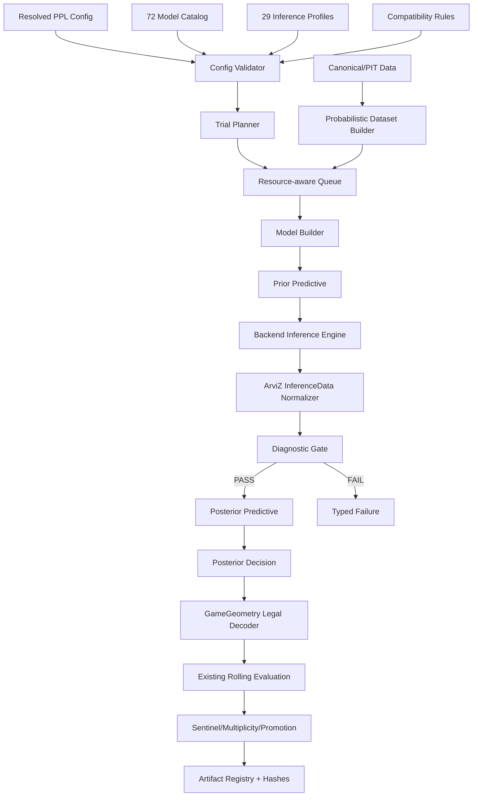

# Batch PPL-01 詳細設計書

**名称**: 確率的プログラミング・ベイズ時系列フルモデル拡張 — 詳細設計  
**対象**: `loto_forecast_platform` v3.2.0  
**上位文書**: `BATCH_PPL01_BASIC_DESIGN.md`  
**状態**: `PROPOSED / DETAILED_DESIGN_COMPLETE`  
**作成日**: 2026-08-03  
**追加モデル**: 72  
**推論プロファイル**: 29  

---

## 1. 文書目的

本書はPPL-01基本設計を、実装担当者がソースファイル、クラス、設定スキーマ、状態遷移、成果物、テストへ直接落とせる粒度まで具体化する。世界中の確率モデルを無制限に網羅するものではなく、付属の72モデル正本を、互換性・予算・診断ゲートのある**有界なフル構成**として実装する。

本書では次の表記を使う。

- **確認済み**: アップロードされた現行リポジトリまたは基本設計に存在する事項。
- **設計決定**: 本詳細設計で新たに固定する事項。
- **未確定**: 実装前probeまたは公式互換性確認が必要な事項。

## 2. 入力とトレーサビリティ

| 区分 | 入力 | SHA-256 / 根拠 |
| --- | --- | --- |
| 現行リポジトリ | `loto_forecast_platform-main(4).zip` | a4508dea6b054cf8c3a409fd7c0544ca202cb8cb0fd6e6f2ee820c8c0ce57049 |
| 基本設計 | `BATCH_PPL01_BASIC_DESIGN.md` | 6221878b7c0ba555a16e702814208139bff0173752979ef97655631e2b67612a |
| モデル正本 | `probabilistic_model_catalog.yaml` | schema=1.0.0, models=72 |
| 推論正本 | `inference_profile_catalog.yaml` | schema=1.0.0, profiles=29 |

### 2.1 確認済みの拡張点

現行ソースから、以下を統合点として使用する。

| 現行要素 | パス | PPL-01での扱い |
|---|---|---|
| `ModelAdapter` / `ModelCapabilities` | `src/loto/models/base.py` | 既存APIを破壊せず、確率モデル用サブインターフェースを追加 |
| `ModelSpec` / `MODEL_SPECS` | `src/loto/models/catalog.py` | 既存カタログは維持し、確率モデル正本を合成するビューを追加 |
| `build_catalog()` | `src/loto/models/catalog_full.py` | 件数計算方式を踏襲し、手書き合計を禁止 |
| `GameGeometry` | `src/loto/game/geometry.py` | shape、範囲、桁数、合法性の唯一の正本 |
| `contracts_for(game)` | `src/loto/contracts_general.py` | ゲーム別Pydantic契約の生成方式を踏襲 |
| `ProtocolSpec` / `protocol_hash` | `src/loto/evaluation/protocol.py` | 比較条件の既存ハッシュを保持し、確率モデル固有ハッシュを別に合成 |
| `point_in_time_join` | `src/loto/features/point_in_time.py` | 外生変数の時点整合を必須化 |
| `ResourceScheduler` | `src/loto/orchestration/resource_scheduler.py` | CPU/GPU semaphoreをジョブクラス制御へ拡張 |
| `artifact_summary` / `model_manifest` | `src/loto/models/artifact_store.py` | pickle中心の既存経路と分離しNetCDF/Zarr/JSONを管理 |
| `assess_promotion` | `src/loto/evaluation/promotion.py` | 既存モデルの閾値を変更せず、PPL専用昇格設定を追加 |
| `RunStateMachine` | `src/loto/orchestration/state_machine.py` | 外側の工程を維持し、TRAIN工程内部にPPLサブ状態機械を持つ |

### 2.2 基本設計から解消する設計ギャップ

| ギャップ | 詳細設計での解決 |
|---|---|
| 閉形式モデルに29サンプラープロファイルが不要 | `analytic_profile_id=builtin-analytic-v1`を実行メタデータとして定義。29件のサンプラー正本には加えない |
| ArviZ stackingは推論バックエンドではない | `MetaModelAdapter`経路で実行し、sampler compatibilityから除外 |
| 現行lifecycleがLoto7の37候補shapeを前提 | PPL専用lifecycleを追加し、`GameGeometry`からshapeを生成 |
| 現行`protocol_hash`にprior/inferenceが含まれない | 比較条件用`protocol_hash`は維持し、再現性用`execution_fingerprint`を追加 |
| `ResourceScheduler`がlight/medium/heavy/exclusiveを持たない | 複数semaphoreとweighted leaseを持つ`ProbabilisticResourceScheduler`を追加 |
| pickleは事後分布保存に不向き | `InferenceData`をNetCDFまたはZarr、要約をParquet、仕様をJSON/YAMLで保存 |
| 既存state machineにprior predictive/diagnosticがない | 外側を変更せず、PPL内部状態をネストする |

## 3. 全体アーキテクチャ



### 3.1 境界原則

1. 既存174モデルのfactory/lifecycleは直接置換しない。
2. 確率モデルは`src/loto/probabilistic/`配下へ隔離する。
3. 比較時のみ既存評価層へ共通prediction tableを渡す。
4. backend固有objectを評価層・CLIへ漏らさない。
5. 非収束・OOM・未導入backendを別モデルへ置換しない。
6. 全予測段階を上書きせず保存する。

## 4. パッケージ・ファイル詳細

```text
src/loto/probabilistic/
├── __init__.py                  # 公開APIのみ
├── contracts.py                 # Pydantic/Dataclass契約
├── statuses.py                  # status/failure code
├── catalog.py                   # YAML読込・正規化・合成ビュー
├── compatibility.py             # model×backend×profile判定
├── config.py                    # 実験設定の解決とhash
├── dataset.py                   # geometry別target/feature tensor
├── priors.py                    # prior profileと変換
├── likelihoods.py               # backend非依存のlikelihood記述
├── model_builder.py             # ModelDefinition→backend graph
├── inference_engine.py          # engine dispatch
├── inference_data.py            # ArviZ共通化
├── diagnostics.py               # MCMC/VI/PPC gate
├── predictive.py                # prior/posterior predictive
├── decision.py                  # utilityとpoint prediction
├── decoder.py                   # 合法組合せdecode
├── lifecycle.py                 # PPL専用fit/save/load/re-predict
├── planner.py                   # 全trial展開・予算制約
├── runner.py                    # queue/resume/status
├── resources.py                 # resource class/semaphore
├── artifact_store.py            # NetCDF/Zarr/Parquet/manifest
├── comparison.py                # LOO/stacking/既存評価接続
├── observability.py             # metrics/trace/log
├── backends/
│   ├── base.py
│   ├── builtin.py
│   ├── pymc_adapter.py
│   ├── numpyro_adapter.py
│   ├── pyro_adapter.py
│   ├── cmdstanpy_adapter.py
│   ├── blackjax_adapter.py
│   └── tfp_adapter.py
└── models/
    ├── conjugate.py
    ├── hierarchical.py
    ├── regression.py
    ├── dynamic.py
    ├── counts.py
    ├── mixtures.py
    ├── deep.py
    └── meta.py
```

### 4.1 設定配置

```text
configs/probabilistic/
├── catalog.yaml
├── inference_profiles.yaml
├── compatibility.yaml
├── prior_profiles.yaml
├── resource_profiles.yaml
├── diagnostic_gates.yaml
├── promotion_gates.yaml
├── smoke.yaml
├── standard.yaml
├── full.yaml
└── exhaustive.yaml
```

### 4.2 テスト配置

```text
tests/probabilistic/
├── unit/
├── contracts/
├── catalog/
├── backends/
├── simulation_recovery/
├── cross_backend/
├── leakage/
├── integration/
├── runtime_certification/
├── evaluation/
└── cli/
```

## 5. 共通型・契約

### 5.1 capability拡張

`ModelCapabilities`の既存bit値を変えないため、新規値は末尾にのみ追加する。

```python
class ModelCapabilities(IntFlag):
    # existing values remain unchanged
    ...
    POSTERIOR_DISTRIBUTION = auto()
    PRIOR_PREDICTIVE = auto()
    POSTERIOR_PREDICTIVE = auto()
    UNCERTAINTY_INTERVAL = auto()
    BAYESIAN_DIAGNOSTICS = auto()
    DISCRETE_LATENT = auto()
    DYNAMIC_LATENT = auto()
    HIERARCHICAL_POOLING = auto()
```

### 5.2 正本契約

```python
@dataclass(frozen=True)
class ProbabilisticModelSpec:
    schema_version: str
    model_id: str
    family: str
    role: Literal['control', 'baseline', 'candidate', 'research', 'meta']
    likelihood: str
    latent_structure: str
    backends: tuple[str, ...]
    tasks: tuple[str, ...]
    priority: Literal['p0', 'p1', 'p2']
    supports_exogenous: bool
    hierarchical: bool
    dynamic: bool
    experimental: bool
    notes: str

@dataclass(frozen=True)
class InferenceProfileSpec:
    profile_id: str
    backend: str
    algorithm: str
    tier: str
    continuous_only: bool
    default: dict[str, object]

@dataclass(frozen=True)
class CompatibilityDecision:
    allowed: bool
    reason_code: str
    resolved_backend: str | None
    resolved_profile: str | None
    required_resource_class: str | None
```

### 5.3 実行要求

```python
class ProbabilisticFitRequest(BaseModel):
    schema_version: str = '1.0.0'
    run_id: str
    trial_id: str
    model_id: str
    game: str
    target_mode: str
    backend: str
    inference_profile_id: str | None
    prior_profile_id: str
    seed: int
    fold: int
    data_uri: str
    output_uri: str
    protocol_hash: str
    data_version: str
    feature_set_hash: str
    resolved_params: dict[str, Any]
    resource_policy: dict[str, Any]
```

閉形式モデルでは`inference_profile_id=None`とし、`analytic_profile_id=builtin-analytic-v1`を`resolved_params`とmanifestへ保存する。

### 5.4 予測分布

```python
class PredictiveDistribution(BaseModel):
    model_id: str
    game: str
    target_mode: str
    draw_id: str
    position: int | None
    candidate: int
    probability_mean: float
    probability_sd: float
    hdi_low: float
    hdi_high: float
    posterior_draw_count: int
    protocol_hash: str
    execution_fingerprint: str
```

shape規則:

| family | target_mode | probability shape |
|---|---|---|
| digits | `digit_categorical` | `[draw, position, 10]` |
| select | `select_position_categorical` | `[draw, position, universe_size]` |
| select | `candidate_inclusion` | `[draw, universe_size]` |
| count | `candidate_count` | `[draw, candidate]` |

### 5.5 診断契約

```python
class DiagnosticReport(BaseModel):
    status: Literal['PASS', 'WARN', 'FAIL', 'NOT_APPLICABLE']
    backend: str
    inference_profile_id: str | None
    rhat_max: float | None
    ess_bulk_min: float | None
    ess_tail_min: float | None
    divergences: int | None
    max_treedepth_hits: int | None
    ebfmi_min: float | None
    elbo_finite: bool | None
    elbo_stable: bool | None
    posterior_finite: bool
    probability_simplex_valid: bool
    warnings: list[str]
    failure_codes: list[str]
```

## 6. ハッシュ・再現性設計

### 6.1 既存`protocol_hash`

既存`ProtocolSpec`は、ゲーム、target、horizon、metric、data version、fold、seed、feature window等の**比較条件**を表す。この意味を変更しない。

### 6.2 新規ハッシュ

| hash | 内容 | 用途 |
|---|---|---|
| `model_spec_hash` | 正規化済みモデル仕様 | モデル定義の同一性 |
| `prior_spec_hash` | prior profile＋解決済みhyperparameter | 事前分布の同一性 |
| `inference_profile_hash` | backend、algorithm、全設定 | 推論条件の同一性 |
| `decision_rule_hash` | utility、lambda、decoder | 点予測決定の同一性 |
| `model_graph_hash` | backend graphの変数名・shape・依存構造 | 実装ドリフト検出 |
| `environment_hash` | lock、Python、backend、CUDA情報 | 実行環境の同一性 |
| `execution_fingerprint` | 上記＋`protocol_hash`のcanonical hash | 完全再現性 |

```text
execution_fingerprint = SHA256(
  protocol_hash || model_spec_hash || prior_spec_hash ||
  inference_profile_hash || decision_rule_hash || environment_hash
)
```

`protocol_hash`が異なる結果のランキングは禁止する。`protocol_hash`が同じで`execution_fingerprint`が異なる結果は、同一評価条件下の別モデル・別推論設定として比較可能だが、個別に表示する。

## 7. カタログ統合

### 7.1 読込順

1. `configs/probabilistic/catalog.yaml`をPydanticで検証。
2. model_id重複、未知family、空backend、未知taskを拒否。
3. 既存`build_catalog()`のmodel_id集合と衝突しないことを確認。
4. `build_unified_catalog()`で既存174＋PPL72を返す。
5. カウントは実データから計算し、`246`を定数として判定しない。

```python
def build_unified_catalog() -> list[UnifiedModelEntry]:
    existing = [UnifiedModelEntry.from_existing(x) for x in build_catalog()]
    probabilistic = load_probabilistic_catalog()
    assert_unique_model_ids([*existing, *probabilistic])
    return [*existing, *probabilistic]
```

### 7.2 状態

各モデルは必ず以下の1状態を持つ。

- `PROPOSED`
- `IMPLEMENTED`
- `UNAVAILABLE`
- `BLOCKED`
- `DEPRECATED`

`UNAVAILABLE`はpackage未導入、`BLOCKED`は既知の互換性・実装制約、`IMPLEMENTED`はcontract/runtime test済みを意味する。`UNAVAILABLE`を失敗モデルへsilent substitutionしない。

## 8. 設定スキーマ

### 8.1 最上位

```yaml
schema_version: 1.0.0
experiment_id: numbers3-ppl-full
profile: full
game: numbers3
target_mode: digit_categorical
horizon: 1
models: {...}
data: {...}
evaluation: {...}
priors: {...}
inference: {...}
decision: {...}
resources: {...}
artifacts: {...}
```

### 8.2 validation rules

- `game`は`known_games()`の値のみ。
- `target_mode`はgeometry familyと整合すること。
- `horizon>=1`。
- sealed holdout有効時、holdout範囲をfeature/prior/hyperparameter選択へ渡さない。
- experimentalモデルは`include_experimental=true`が必要。
- `full`は72モデルを選択対象に含める。実行不能はtyped statusとして残す。
- `exhaustive`は`budget_hours`または`max_trials`の少なくとも一方が必須。
- GPU job数は利用GPU数を超えない。
- `mse_penalty_grid`の選択はdevelopment内だけ。
- target列、future outcome列をfeature allowlistへ含めない。

### 8.3 解決済み設定

入力YAMLを直接実行せず、default、profile、model overrideをマージした`resolved_config.yaml`を作成する。優先順位は次とする。

```text
library default < project profile < model default < experiment override < CLI override
```

全overrideは`argument_evidence.json`へ、`REQUESTED/APPLIED/IGNORED/UNSUPPORTED`として保存する。

## 9. データセット設計

### 9.1 共通入力

```python
@dataclass(frozen=True)
class ProbabilisticDataset:
    geometry: GameGeometry
    draw_ids: np.ndarray
    timestamps: np.ndarray
    y: np.ndarray
    x_hist: np.ndarray | None
    x_futr: np.ndarray | None
    x_stat: np.ndarray | None
    feature_names: tuple[str, ...]
    feature_set_hash: str
    data_version: str
```

### 9.2 digits

- Numbers3: `y.shape=[n_draws,3]`
- Numbers4: `y.shape=[n_draws,4]`
- 各桁は0～9。
- categoricalモデルではlong形式`[observation, position, class]`へ変換可能。
- leading zeroを維持する。

### 9.3 select

- mini/loto6/loto7/bingo5は`GameGeometry`のpositionsとvalue rangeを使う。
- position categoricalは各位置の候補値確率を出す。
- candidate inclusionは候補ごとの周辺包含確率を出す。
- position単独分布は合法組合せ分布ではないため、decoderでdistinct/ascendingを強制する。

### 9.4 point-in-time

- `x_hist__`: cutoffより前に確定済みの履歴特徴。
- `x_futr__`: 予測時点で既知のカレンダー等。
- `x_stat__`: train foldだけでfitした統計量。
- `feature_time <= observation_time`を既存`point_in_time_join`で検証。
- prior hyperparameterのempirical Bayes推定もtrain fold内のみ。

## 10. 事前分布設計

### 10.1 prior profile正本

| profile | 主要用途 | 代表設定 |
|---|---|---|
| `skeptical` | 効果を0へ強く縮小 | 標準化係数`Normal(0,0.25)`相当 |
| `weakly_informative` | 標準比較 | 標準化係数`Normal(0,1)`相当 |
| `historical_empirical_bayes` | development内で集中度推定 | holdoutを使用禁止 |
| `robust_heavy_tail` | 外れ値耐性 | Student-t系 |
| `sparse_horseshoe` | 多数特徴量 | regularized horseshoe優先 |
| `dynamic_low_variance` | 時変確率を緩やかにする | innovation scaleを縮小 |

具体的分布・scaleはモデル別simulation recoveryで確定し、基本設計の名称だけから数値を固定しない。

### 10.2 prior predictive gate

- probability simplexが成立。
- ゲーム範囲外の値を生成しない。
- 動的モデルの事前が短期間で0/1へ飽和しない。
- countモデルが現実的上限を極端に超えない。
- prior predictiveのentropy、range、meanを保存。
- 不合格ならposterior inferenceを開始しない。

## 11. backend adapter

### 11.1 共通API

```python
class ProbabilisticBackendAdapter(ABC):
    backend_id: str

    @abstractmethod
    def availability(self) -> BackendAvailability: ...

    @abstractmethod
    def build(self, definition, dataset, prior, config) -> BackendModelHandle: ...

    @abstractmethod
    def prior_predictive(self, handle, *, draws: int, seed: int) -> Any: ...

    @abstractmethod
    def infer(self, handle, profile, *, seed: int) -> BackendFitResult: ...

    @abstractmethod
    def posterior_predictive(self, fit, future, *, draws: int, seed: int) -> Any: ...

    @abstractmethod
    def to_inference_data(self, fit, predictive) -> arviz.InferenceData: ...

    @abstractmethod
    def save_native(self, fit, path: Path) -> list[Path]: ...
```

### 11.2 PyMC

- 主経路: p0/p1の共役、階層、回帰、状態空間、校正。
- `pm.Data`等のmutable inputはfoldを跨いで再利用しない。
- NUTS、Gibbs/Metropolis、SMC、ADVIをprofileで選択。
- `InferenceData`を正本保存。
- PyMC-BARTはoptional extraとavailability probeを分離。

### 11.3 NumPyro / BlackJAX

- JAX compile timeとsampling timeを分離計測。
- GPUは1 job semaphore。
- chain methodは`parallel`を無条件指定せず、device countにより`sequential/vectorized/parallel`を解決。
- shape polymorphismによる再compileを減らすため、fold内shapeを固定。
- direct BlackJAXはresearch profileのみ。正式候補は同等のNUTS確認を必要とする。

### 11.4 Pyro

- Deep PPLの主経路。
- SVI screening後、可能な小型モデルはNUTSまたはsimulation recoveryで検証。
- param storeをtrialごとにclearし、trial間汚染を禁止。
- checkpointにguide、optimizer、param store、model configを保存。

### 11.5 CmdStanPy

- 主実装ではなく監査経路。
- Stan source、compiled executable hash、CmdStan versionを保存。
- chain CSVを保存し、ArviZへ変換。
- representative modelsの予測要約をPyMC/NumPyroと比較。

### 11.6 TFP

- Python/TensorFlow/JAX/CUDA競合を避ける隔離環境。
- `quarantine` tier以外では自動選択しない。
- 失敗してもPyroモデルへ自動置換しない。

## 12. compatibility planner

### 12.1 判定順

1. modelが要求backendを宣言しているか。
2. package/versionが利用可能か。
3. profile backendが一致するか。
4. discrete latentと`continuous_only`が矛盾しないか。
5. target_modeをmodelが対応しているか。
6. exogenous要求とfeature availabilityが整合するか。
7. resource budgetに収まるか。
8. experimental gateが開いているか。

### 12.2 reason code

- `ALLOWED`
- `BACKEND_NOT_DECLARED`
- `BACKEND_UNAVAILABLE`
- `PROFILE_BACKEND_MISMATCH`
- `CONTINUOUS_SAMPLER_WITH_DISCRETE_LATENT`
- `TARGET_MODE_UNSUPPORTED`
- `EXOGENOUS_FEATURES_MISSING`
- `RESOURCE_BUDGET_EXCEEDED`
- `EXPERIMENTAL_DISABLED`
- `MODEL_BLOCKED`

### 12.3 trial expansion

`full`:

- 全72モデルを候補化。
- 各modelのprimary pathを1つ以上試行。
- screeningがあるモデルはscreening→上位設定confirmatory。
- cross-backend対象4モデルは監査経路を追加。

`exhaustive`:

- compatibilityで`ALLOWED`のmodel×profileを展開。
- 同一アルゴリズムの表面上の重複経路もbackend監査として別trial扱い。
- total trial、CPU/GPU budget、failure ceilingを必須化。

## 13. モデルファミリー詳細

| ファミリー | 件数 | 実装モジュール | 主バッチ |
| --- | --- | --- | --- |
| bayesian_regression | 5 | models/regression.py | PPL-01.5 |
| calibration | 3 | models/meta.py | PPL-01.9 |
| changepoint | 2 | models/dynamic.py | PPL-01.6 |
| conjugate | 8 | models/conjugate.py | PPL-01.2 |
| count | 8 | models/counts.py | PPL-01.7 |
| decision | 3 | models/meta.py | PPL-01.9 |
| deep_probabilistic | 10 | models/deep.py | PPL-01.8 |
| dynamic_conjugate | 1 | models/dynamic.py | PPL-01.6 |
| empirical_bayes | 1 | models/conjugate.py | PPL-01.2 |
| ensemble | 3 | models/meta.py | PPL-01.9 |
| gaussian_process | 2 | models/regression.py | PPL-01.5 |
| hierarchical | 2 | models/hierarchical.py | PPL-01.2 |
| mixture | 3 | models/mixtures.py | PPL-01.7 |
| nonparametric | 5 | models/mixtures.py | PPL-01.7 |
| ordinal | 3 | models/regression.py | PPL-01.5 |
| regime_switching | 4 | models/dynamic.py | PPL-01.6 |
| semi_parametric | 2 | models/regression.py | PPL-01.5 |
| state_space | 6 | models/dynamic.py | PPL-01.6 |
| tree_bayesian | 1 | models/regression.py | PPL-01.5 |

### 13.1 共役・経験ベイズ

対象: static/expanding/rolling/discounted Dirichlet、Dirichlet-Multinomial、Beta-Binomial。

- sufficient statisticsをfold内で計算。
- builtin閉形式をreference implementationとする。
- PyMC/NumPyro/Stanは同一事後要約を再現する監査実装。
- rolling window、discount factor、concentrationはdevelopment内で選択しholdoutで凍結。
- 境界classを含む10カテゴリ全てへ正のprior massを持たせる。

### 13.2 階層

- digits: global→position→classの部分プーリング。
- games: global→game→position→class。ただしゲーム間値域差はgeometry別のlocal class indexへ写像。
- centered/non-centeredを切替可能にし、divergence時に自動再parameterizeは行わず別trialとして記録。
- posterior shrinkage量を成果物へ保存。

### 13.3 Bayesian regression / ordinal / semiparametric

- featureはfold内標準化し、transformer stateを保存。
- categorical class識別のためreference classまたはsum-to-zero制約を固定。
- ordinalは値順序を利用するが、抽選機構に順序依存があるとの因果主張はしない。
- horseshoeは局所・大域scale、regularized slabを保存。
- spline/GAM basisはtrain foldだけで構築し、knotをholdoutから選ばない。
- BART/GPは計算量上限と入力特徴数上限を設定。

### 13.4 動的・状態空間・変化点

- latent time indexはdraw orderを正本とする。
- innovation varianceに`dynamic_low_variance` priorを適用可能。
- forecast時はlatent stateのposterior transitionから予測する。
- change point数・位置はdevelopment内で推定し、holdoutを見て追加しない。
- label switching、state permutationはcanonical relabelingまたは予測分布で評価。

### 13.5 count

- candidate出現回数、window countなど、定義済みcount targetだけに使用。
- 元の抽選値を無理にPoisson回帰へ変換しない。
- offset/exposureを明示し、window length差を補正。
- zero-inflated/hurdleはzero比率診断と単純NBへの比較を必須化。

### 13.6 mixture / nonparametric

- truncation levelを明示し、無限モデルを無界に実行しない。
- label switchingを考慮したsimulation recovery。
- cluster数を予測可能性と同一視しない。
- DP/HDP系はp2 research、正式昇格には単純モデルに対するrolling改善が必要。

### 13.7 deep probabilistic

- Bayesian MLP/TCN/GRU/LSTM/Transformer、VRNN、DMM、Neural HMM。
- Pyro SVIをprimary screeningとし、guide familyをmanifestへ保存。
- seed ensembleではなくposterior drawを第一の不確実性表現とする。
- prediction collapse、posterior collapse、KL vanishingを別診断として保存。
- deterministic NN baselineと同一feature/cutoffで比較。

### 13.8 calibration / ensemble / decision

- calibrationはOOF予測だけでfitし、同じ予測へin-sample fitしない。
- PSIS-LOO stackingはベイズ内部比較の補助であり、sealed rolling holdoutを置換しない。
- dynamic model averagingのweight更新は過去時点だけ。
- decision adapterはmodel countへ含めるが、独立した生成モデルではないことをrole=`meta`で表示。

## 14. 推論プロファイル詳細

| profile_id | backend | algorithm | tier | 連続のみ | 既定値 |
| --- | --- | --- | --- | --- | --- |
| pymc-nuts | pymc | NUTS | confirmatory | True | {"chains": 4, "draws": 1000, "tune": 1000, "target_accept": 0.9} |
| pymc-hmc | pymc | HMC | research | True | {"chains": 4, "draws": 1000, "tune": 1000} |
| pymc-categorical-gibbs | pymc | CategoricalGibbsMetropolis | discrete | False | {"chains": 4, "draws": 2000, "tune": 1000} |
| pymc-metropolis | pymc | Metropolis | fallback | False | {"chains": 4, "draws": 4000, "tune": 2000} |
| pymc-slice | pymc | Slice | fallback | True | {"chains": 4, "draws": 2000, "tune": 1000} |
| pymc-smc | pymc | SMC | multimodal | False | {"draws": 2000, "chains": 4} |
| pymc-advi-meanfield | pymc | ADVI mean-field | screening | True | {"steps": 30000, "posterior_draws": 2000} |
| pymc-advi-fullrank | pymc | Full-rank ADVI | screening | True | {"steps": 30000, "posterior_draws": 2000} |
| pymc-blackjax-nuts | pymc+blackjax | BlackJAX NUTS | accelerated | True | {"chains": 4, "draws": 1000, "tune": 1000} |
| pymc-numpyro-nuts | pymc+numpyro | NumPyro NUTS | accelerated | True | {"chains": 4, "draws": 1000, "tune": 1000} |
| numpyro-nuts | numpyro | NUTS | confirmatory | True | {"chains": 4, "samples": 1000, "warmup": 1000} |
| numpyro-hmc | numpyro | HMC | research | True | {"chains": 4, "samples": 1000, "warmup": 1000} |
| numpyro-mixedhmc | numpyro | MixedHMC | discrete | False | {"chains": 4, "samples": 1500, "warmup": 1000} |
| numpyro-svi-normal | numpyro | SVI AutoNormal | screening | False | {"steps": 30000, "posterior_draws": 2000} |
| numpyro-svi-lowrank | numpyro | SVI AutoLowRankMultivariateNormal | screening | True | {"steps": 30000, "posterior_draws": 2000} |
| pyro-nuts | pyro | NUTS | confirmatory | True | {"chains": 4, "samples": 1000, "warmup": 1000} |
| pyro-svi-autonormal | pyro | SVI AutoNormal | deep_screening | False | {"steps": 50000, "particles": 8, "posterior_draws": 2000} |
| pyro-svi-autolowrank | pyro | SVI AutoLowRankMultivariateNormal | deep_screening | True | {"steps": 50000, "particles": 8, "posterior_draws": 2000} |
| pyro-smc | pyro | Sequential Monte Carlo | sequential | False | {"particles": 2048} |
| stan-nuts | cmdstanpy | NUTS-HMC | audit | True | {"chains": 4, "iter_sampling": 1000, "iter_warmup": 1000, "adapt_delta": 0.9} |
| stan-pathfinder | cmdstanpy | Pathfinder | screening | True | {"num_paths": 4, "draws": 2000} |
| stan-advi | cmdstanpy | ADVI | screening | True | {"iter": 30000, "output_samples": 2000} |
| stan-map | cmdstanpy | MAP optimization | diagnostic | True | {} |
| blackjax-nuts-direct | blackjax | NUTS | research | True | {"chains": 4, "samples": 1000, "warmup": 1000} |
| blackjax-tempered-smc | blackjax | Adaptive tempered SMC | multimodal | True | {"particles": 2048} |
| blackjax-pathfinder | blackjax | Pathfinder | screening | True | {"paths": 4, "draws": 2000} |
| tfp-nuts | tensorflow_probability | NUTS | quarantine | True | {"chains": 4, "samples": 1000, "burnin": 1000} |
| tfp-hmc | tensorflow_probability | HMC | quarantine | True | {"chains": 4, "samples": 1000, "burnin": 1000} |
| tfp-vi | tensorflow_probability | Variational inference | quarantine | False | {"steps": 50000, "posterior_draws": 2000} |

### 14.1 選択ポリシー

| 状況 | screening | confirmatory | fallback |
|---|---|---|---|
| 連続潜在・中規模 | ADVI/Pathfinder | NUTS | HMC/Slice |
| 離散潜在 | model-specific marginalization | Gibbs/MixedHMC/SMC | Metropolis |
| multimodal/mixture | SMC/VI | SMC＋複数初期値 | typed fail |
| deep | Pyro SVI | 小型simulation/NUTS監査 | typed fail |
| cross-backend | Pathfinder/VI | PyMC/NumPyro/Stan NUTS | 比較不能を明示 |

近似推論だけの上位候補を本番昇格させない。confirmatoryが実行不能なdeep modelは、simulation recovery、複数seed SVI、calibration、sealed holdoutを追加条件とする。

## 15. lifecycle詳細

### 15.1 PPL内部状態

```text
QUEUED
→ VALIDATING
→ BUILDING
→ PRIOR_PREDICTIVE
→ INFERRING
→ NORMALIZING
→ DIAGNOSING
→ POSTERIOR_PREDICTIVE
→ DECIDING
→ DECODING
→ EVALUATING
→ SAVING
→ SUCCEEDED
```

任意段階から`FAILED/CANCELLED/TIMED_OUT/OOM/BLOCKED/UNAVAILABLE`へ遷移できる。

### 15.2 retry

| failure | retry |
|---|---|
| 一時的I/O | 同一条件で最大1回 |
| GPU OOM | 同一モデルの明示的small batch profileを別trialとして起票 |
| divergence | 自動的に結果を採用しない。target_accept変更またはreparameterized configを別trial |
| timeout | resume可能checkpointがある場合のみ再開 |
| backend unavailable | retryなし |
| invalid probability | retryなし、実装バグ扱い |

パラメータを暗黙に変更して同じtrial_idで再実行しない。

### 15.3 save/load

- model definition: JSON/YAML。
- inference data: NetCDFまたはZarr。
- backend native: optional、明示的manifest。
- prediction reproducibility: 保存済みposterior drawsから再計算した要約が許容差内。
- stochastic posterior predictiveは同一seedで再現し、別seedでは分布要約を比較。

## 16. リソーススケジューラ

### 16.1 semaphore

```python
@dataclass(frozen=True)
class ProbabilisticResourcePolicy:
    outer_workers: int = 8
    max_light_cpu_jobs: int = 8
    max_medium_cpu_jobs: int = 4
    max_heavy_cpu_jobs: int = 2
    max_exclusive_jobs: int = 1
    max_gpu_jobs: int = 1
    blas_threads_light: int = 1
    blas_threads_medium: int = 2
    blas_threads_heavy: int = 4
```

### 16.2 lease

leaseには`resource_class`、CPU thread、GPU id、推定RAM/VRAM、開始/終了、待機時間を保存する。外側8ワーカーは常時維持するが、重いjobの枠が埋まった場合は軽量診断・artifact処理または待機へ回す。

### 16.3 subprocess隔離

- PyMC/NumPyro/Pyro/Stan/TFPは原則subprocess worker。
- backendごとの環境変数をjob documentへ固定。
- `OMP_NUM_THREADS`等をjob単位で設定。
- SIGTERM時にstatus/checkpointをflush。
- stdout/stderrをtrialごとに保存。

## 17. 事後予測と意思決定

### 17.1 digits

```text
exact(k) = P(Y=k | D)
hit1(k)  = Σ P(Y=j | D), j∈{k-1,k,k+1}∩[0,9]
utility(k) = hit1(k) - λ E[(Y-k)^2 | D]
```

- λはdevelopmentだけで選択。
- raw probability、calibrated probability、decision scoreを別列に保存。
- 3/4桁全体のjoint utilityは、独立近似とjoint posterior sample方式を別rule idとする。

### 17.2 select

- marginal top-kはraw baseline。
- constrained top-kはdistinct/rangeのみ。
- dynamic programmingはposition utility＋合法性。
- posterior sample frequencyは合法sampleのみ集計。
- decoderが修正した距離、重複違反、順序違反を保存。

### 17.3 prediction table

必須列:

```text
run_id, trial_id, model_id, backend, inference_profile_id,
protocol_hash, execution_fingerprint, fold, seed, draw_id,
position, candidate, probability_mean, probability_sd,
hdi_low, hdi_high, raw_score, calibrated_score,
decision_score, point_prediction_raw, point_prediction_decoded,
decision_rule_id, decoder_id
```

## 18. 診断ゲート

### 18.1 MCMC

- divergence=0をPASS条件。
- rank-normalized R-hat `<=1.01`。
- bulk/tail ESSは主要パラメータ各400以上を目標。未達はFAILまたはモデル別明示基準。
- tree depth連続到達なし。
- E-BFMI警告なし。
- posterior全有限。
- simplex誤差は許容誤差内。

### 18.2 VI

- ELBO有限。
- 終盤windowの傾き・分散による安定性判定。
- 3初期値以上で主要予測要約が極端に変わらない。
- p0代表モデルでNUTSとのpredictive distanceを検証。
- posterior collapse指標を保存。

### 18.3 PPC

- 観測統計: class frequency、position mean、entropy、run length、transition、window variance。
- prior vs posterior predictiveを同一統計で比較。
- p-value単独で採用判断しない。
- coverageとinterval widthの両方を表示。

### 18.4 Pareto-k / LOO

- pointwise log likelihoodを保存できるモデルだけ対象。
- Pareto-k警告を持つモデルをstackingへ無条件投入しない。
- LOO順位をrolling holdout順位の代用にしない。

## 19. 評価統合

### 19.1 fold

既存`rolling_folds`と`split_development_holdout`を使用し、PPL runner側で独自の時間分割を重複実装しない。

### 19.2 mandatory controls

- uniform/random。
- expanding/rolling Dirichlet。
- train-only fixed decision。
- prior-only control。
- permutation/time-shift/feature-shuffle。

controlが欠けるrunは`INCOMPLETE_PROTOCOL`とし、champion選定を行わない。

### 19.3 指標

- 点: Hit@±1、exact、MAE、MSE、RMSE、all positions within1。
- 確率: Brier、log loss、ECE、CRPS、RPS。
- 区間: coverage、width、calibration error。
- 安定性: fold wins、worst block、seed variance、prediction diversity。
- ベイズ補助: LOO-ELPD、Pareto-k、WAIC。

### 19.4 promotion

既存`assess_promotion`の閾値は変更しない。PPL用にconfig-drivenな`assess_probabilistic_promotion`を追加し、基本設計の条件を実装する。

- diagnostic PASS。
- negative control PASS。
- primary metric改善。
- 多重比較補正後の証拠。
- Brier/log loss/ECE非劣性。
- worst block guard。
- sealed holdout。
- prospective 100以上。
- prediction collapseなし。
- `champion=None`を許可。

## 20. 成果物・スキーマ

```text
runs/probabilistic/<run-id>/
├── run_config.yaml
├── resolved_config.yaml
├── protocol.json
├── execution_fingerprint.json
├── catalog_snapshot.yaml
├── inference_profiles_snapshot.yaml
├── compatibility_snapshot.yaml
├── environment.json
├── status/
├── jobs/
├── models/<model>/<fold>/<seed>/<profile>/
│   ├── model_spec.json
│   ├── prior_spec.json
│   ├── model_graph.json
│   ├── inference_profile.json
│   ├── inference_data.nc | inference_data.zarr/
│   ├── prior_predictive.parquet
│   ├── posterior_summary.parquet
│   ├── posterior_predictive.parquet
│   ├── predictions.parquet
│   ├── diagnostics.json
│   ├── resource_metrics.json
│   ├── argument_evidence.json
│   ├── lifecycle_result.json
│   ├── model_manifest.json
│   └── SHA256SUMS.json
├── comparison/
└── report/
```

### 20.1 storage selection

| 条件 | 形式 |
|---|---|
| 小型・単一trial | NetCDF |
| 大型posterior/並列書込 | Zarr |
| 表形式要約 | Parquet |
| 設定・診断・manifest | JSON/YAML |
| Stan chain | native CSV＋InferenceData |
| Pyro checkpoint | backend native＋hash |

### 20.2 retention

- smoke失敗のfull posteriorは保持任意、diagnostic/log/manifestは保持。
- full/holdout/prospectiveは全証跡保持。
- artifact pruningはmanifestを更新し、削除前後hashを記録。

## 21. status / error taxonomy

| code | 意味 | ranking |
|---|---|---|
| `PASS` | 全必須段階成功 | 対象 |
| `UNAVAILABLE` | backend/packageなし | 対象外 |
| `BLOCKED` | 既知互換性・未実装 | 対象外 |
| `CONFIG_INVALID` | 設定契約違反 | 対象外 |
| `MODEL_BUILD_FAILED` | graph構築失敗 | 対象外 |
| `PRIOR_PREDICTIVE_FAILED` | prior gate失敗 | 対象外 |
| `INFERENCE_FAILED` | backend実行失敗 | 対象外 |
| `NON_CONVERGED` | diagnostic不合格 | 対象外 |
| `POSTERIOR_INVALID` | NaN/simplex違反 | 対象外 |
| `PREDICTION_COLLAPSE` | 多様性不足 | 対象外 |
| `DECODE_FAILED` | 合法出力不可 | 対象外 |
| `LEAKAGE_DETECTED` | PIT/target leakage | run全体停止候補 |
| `SENTINEL_TRIP` | 負の対照異常 | championなし |
| `TIMEOUT` | 上限超過 | 対象外 |
| `OOM` | RAM/VRAM不足 | 対象外 |
| `HASH_MISMATCH` | 成果物破損 | 対象外 |

## 22. CLI詳細

```bash
loto3 probabilistic catalog list [--family F] [--status S]
loto3 probabilistic catalog show MODEL_ID
loto3 probabilistic profiles list [--backend B]
loto3 probabilistic compatibility --model M --profile P
loto3 probabilistic validate-config --config FILE
loto3 probabilistic plan --config FILE --output PLAN.json
loto3 probabilistic smoke --config FILE
loto3 probabilistic run --config FILE
loto3 probabilistic resume --run-dir DIR
loto3 probabilistic status --run-dir DIR
loto3 probabilistic diagnose --run-dir DIR
loto3 probabilistic compare --run-dir DIR
loto3 probabilistic cross-backend --config FILE
loto3 probabilistic posterior-predict --model-dir DIR --input FILE
loto3 probabilistic export-inferencedata --run-dir DIR
```

CLIはthin wrapperとし、business logicを`runner.py`へ置く。`--dry-run`ではtrial plan、resource class、除外理由、予算見積りの単位数のみを表示し、実行時間を保証しない。

終了コード:

- `0`: requested operation completed。
- `2`: config/argument error。
- `3`: partial completion with typed model failures。
- `4`: integrity/hash failure。
- `5`: leakage/sentinel critical failure。
- `130`: interrupted。

## 23. observability

Prometheus例:

```text
loto_ppl_trial_total{status,backend,family}
loto_ppl_active_jobs{resource_class}
loto_ppl_queue_wait_seconds
loto_ppl_inference_seconds{backend,algorithm}
loto_ppl_compile_seconds{backend}
loto_ppl_divergences_total{model_id}
loto_ppl_rhat_max{model_id}
loto_ppl_ess_bulk_min{model_id}
loto_ppl_gpu_memory_peak_mib{model_id}
loto_ppl_artifact_bytes{model_id}
```

trace span:

```text
ppl.run
 └─ ppl.trial
     ├─ dataset.build
     ├─ model.build
     ├─ prior.predictive
     ├─ inference
     ├─ diagnostics
     ├─ posterior.predictive
     ├─ decision
     ├─ evaluation
     └─ artifact.commit
```

高カーディナリティのrun_id/model_idはメトリクスlabelへ無制限に入れず、trace/log/manifestへ保存する。

## 24. セキュリティ・整合性

- YAML loaderはsafe load。
- output pathはrun root配下へ正規化しpath traversalを拒否。
- Stan source/compiled binary、backend native checkpointを信頼できるrunだけからload。
- pickleは新規PPL正本に使わない。既存pickle互換は別経路。
- subprocess commandはshell文字列連結でなくargv配列。
- secretsをresolved config/environmentへ保存しない。
- run内部manifestとリポジトリ権威マニフェストを分離。

## 25. テスト詳細

### 25.1 contract/unit

- 全72modelのschema validation。
- 29profileのschema validation。
- model ID/profile ID重複0。
- existing catalogとの衝突0。
- task/geometry compatibility。
- canonical hash安定性。
- probability simplex/shape/finite。
- status transition。

### 25.2 simulation recovery

| family | 最低回復対象 |
|---|---|
| conjugate | class probabilities/concentration |
| hierarchical | global/local mean、pooling strength |
| regression | coefficient sign/magnitude |
| dynamic | innovation scale/latent trend |
| changepoint | location/rate difference |
| HMM | transition/emission、label invariant |
| count | mean/dispersion/zero inflation |
| mixture | predictive density、label invariant |
| deep | calibrated predictive distribution、collapseなし |

### 25.3 cross-backend reference

- `pp-static-dirichlet-categorical`
- `pp-hierarchical-dirichlet-digits`
- `pp-multinomial-logit-normal`
- `pp-logistic-normal-random-walk`

比較項目: posterior mean、sd、quantiles、posterior predictive class probability。MCMC drawの完全一致は要求しない。

### 25.4 integration

- plan→queue→resume。
- 8 worker、heavy=2、GPU=1。
- SIGTERM recovery。
- partial failuresを含むreport。
- protocol mismatch拒否。
- holdout不可視性。
- sentinel trip時championなし。
- save/load/posterior re-summary。

### 25.5 release

- targeted testsは各バッチ。
- full pytest/ruff/mypy/integrity/catalog regenerationはrelease gateで一括。
- CIを最後だけに寄せる方針でも、変更対象unit/smokeを各バッチで省略しない。

## 26. backward compatibility

- 既存`loto`/`loto3`コマンドを変更しない。
- 既存catalog ID・順序・件数を単独APIでは維持。
- unified catalogは新規API/CLIで提供。
- 既存`ModelLifecycleResult`を変更せず`ProbabilisticLifecycleResult`を追加。
- 既存artifact pathを移動しない。
- PPL optional extras未導入でも通常test/CLIがimport errorにならない遅延importを徹底。

## 27. モデル実装トレーサビリティ

下表は付属72モデル正本から生成した実装配置案である。`backend/profile`はprimary pathであり、catalog記載の全互換経路は`exhaustive`で別途展開する。

| model_id | family | role | priority | module | phase | backend | profile | resource | tests |
| --- | --- | --- | --- | --- | --- | --- | --- | --- | --- |
| pp-uniform-dirichlet | conjugate | control | p0 | models/conjugate.py | PPL-01.2 | builtin | analytic (sampler catalog outside) | light | contract+runtime+simulation_recovery+rolling+cross_backend |
| pp-static-dirichlet-categorical | conjugate | baseline | p0 | models/conjugate.py | PPL-01.2 | builtin | analytic (sampler catalog outside) | light | contract+runtime+simulation_recovery+rolling+cross_backend |
| pp-expanding-dirichlet-categorical | conjugate | baseline | p0 | models/conjugate.py | PPL-01.2 | builtin | analytic (sampler catalog outside) | light | contract+runtime+simulation_recovery+rolling+cross_backend |
| pp-rolling-dirichlet-categorical | conjugate | candidate | p0 | models/conjugate.py | PPL-01.2 | builtin | analytic (sampler catalog outside) | light | contract+runtime+simulation_recovery+rolling+cross_backend |
| pp-discounted-dirichlet-categorical | conjugate | candidate | p0 | models/conjugate.py | PPL-01.2 | builtin | analytic (sampler catalog outside) | light | contract+runtime+simulation_recovery+rolling+cross_backend |
| pp-empirical-bayes-dirichlet | empirical_bayes | candidate | p0 | models/conjugate.py | PPL-01.2 | pymc | pymc-nuts | medium | contract+runtime+simulation_recovery+rolling+cross_backend |
| pp-dirichlet-multinomial | conjugate | candidate | p1 | models/conjugate.py | PPL-01.2 | pymc | pymc-nuts | heavy | contract+runtime+simulation_recovery+rolling |
| pp-beta-binomial-position | conjugate | candidate | p1 | models/conjugate.py | PPL-01.2 | pymc | pymc-nuts | heavy | contract+runtime+simulation_recovery+rolling |
| pp-beta-binomial-candidate | conjugate | candidate | p1 | models/conjugate.py | PPL-01.2 | pymc | pymc-nuts | heavy | contract+runtime+simulation_recovery+rolling |
| pp-hierarchical-dirichlet-digits | hierarchical | candidate | p0 | models/hierarchical.py | PPL-01.2 | pymc | pymc-nuts | medium | contract+runtime+simulation_recovery+rolling+cross_backend |
| pp-hierarchical-dirichlet-games | hierarchical | candidate | p1 | models/hierarchical.py | PPL-01.2 | pymc | pymc-nuts | heavy | contract+runtime+simulation_recovery+rolling |
| pp-multinomial-logit-normal | bayesian_regression | candidate | p0 | models/regression.py | PPL-01.5 | pymc | pymc-nuts | medium | contract+runtime+simulation_recovery+rolling+cross_backend |
| pp-multinomial-logit-laplace | bayesian_regression | candidate | p1 | models/regression.py | PPL-01.5 | pymc | pymc-nuts | heavy | contract+runtime+simulation_recovery+rolling |
| pp-multinomial-logit-horseshoe | bayesian_regression | candidate | p1 | models/regression.py | PPL-01.5 | pymc | pymc-nuts | heavy | contract+runtime+simulation_recovery+rolling |
| pp-multinomial-logit-regularized-horseshoe | bayesian_regression | candidate | p1 | models/regression.py | PPL-01.5 | pymc | pymc-nuts | heavy | contract+runtime+simulation_recovery+rolling |
| pp-multinomial-probit | bayesian_regression | research | p2 | models/regression.py | PPL-01.5 | pymc | pymc-advi-fullrank | heavy | contract+runtime+simulation_recovery+rolling+bounded_budget |
| pp-ordinal-cumulative-logit | ordinal | candidate | p0 | models/regression.py | PPL-01.5 | pymc | pymc-nuts | medium | contract+runtime+simulation_recovery+rolling+cross_backend |
| pp-ordinal-adjacent-category | ordinal | candidate | p1 | models/regression.py | PPL-01.5 | pymc | pymc-nuts | heavy | contract+runtime+simulation_recovery+rolling |
| pp-ordinal-continuation-ratio | ordinal | candidate | p1 | models/regression.py | PPL-01.5 | pymc | pymc-nuts | heavy | contract+runtime+simulation_recovery+rolling |
| pp-bayesian-spline-categorical | semi_parametric | candidate | p1 | models/regression.py | PPL-01.5 | pymc | pymc-nuts | heavy | contract+runtime+simulation_recovery+rolling |
| pp-bayesian-gam-categorical | semi_parametric | candidate | p1 | models/regression.py | PPL-01.5 | pymc | pymc-nuts | heavy | contract+runtime+simulation_recovery+rolling |
| pp-bart-categorical | tree_bayesian | candidate | p1 | models/regression.py | PPL-01.5 | pymc_bart | stan-nuts | heavy | contract+runtime+simulation_recovery+rolling |
| pp-gp-categorical | gaussian_process | research | p2 | models/regression.py | PPL-01.5 | pymc | pymc-advi-fullrank | heavy | contract+runtime+simulation_recovery+rolling+bounded_budget |
| pp-dynamic-dirichlet-discount | dynamic_conjugate | candidate | p0 | models/dynamic.py | PPL-01.6 | pymc | pymc-nuts | medium | contract+runtime+simulation_recovery+rolling+cross_backend |
| pp-logistic-normal-random-walk | state_space | candidate | p0 | models/dynamic.py | PPL-01.6 | pymc | pymc-nuts | medium | contract+runtime+simulation_recovery+rolling+cross_backend |
| pp-local-level-categorical | state_space | candidate | p1 | models/dynamic.py | PPL-01.6 | pymc | pymc-nuts | heavy | contract+runtime+simulation_recovery+rolling |
| pp-local-linear-trend-categorical | state_space | candidate | p1 | models/dynamic.py | PPL-01.6 | pymc | pymc-nuts | heavy | contract+runtime+simulation_recovery+rolling |
| pp-dynamic-regression-categorical | state_space | candidate | p1 | models/dynamic.py | PPL-01.6 | pymc | pymc-nuts | heavy | contract+runtime+simulation_recovery+rolling |
| pp-dynamic-horseshoe-categorical | state_space | research | p2 | models/dynamic.py | PPL-01.6 | pymc | pymc-advi-fullrank | heavy | contract+runtime+simulation_recovery+rolling+bounded_budget |
| pp-single-changepoint-categorical | changepoint | candidate | p1 | models/dynamic.py | PPL-01.6 | pymc | pymc-smc | heavy | contract+runtime+simulation_recovery+rolling |
| pp-multiple-changepoint-categorical | changepoint | research | p2 | models/dynamic.py | PPL-01.6 | pymc | pymc-smc | heavy | contract+runtime+simulation_recovery+rolling+bounded_budget |
| pp-hmm-categorical | regime_switching | candidate | p1 | models/dynamic.py | PPL-01.6 | pymc | pymc-smc | heavy | contract+runtime+simulation_recovery+rolling |
| pp-hsmm-categorical | regime_switching | research | p2 | models/dynamic.py | PPL-01.6 | numpyro | numpyro-svi-lowrank | heavy | contract+runtime+simulation_recovery+rolling+bounded_budget |
| pp-switching-logistic-normal | regime_switching | research | p2 | models/dynamic.py | PPL-01.6 | numpyro | numpyro-svi-lowrank | heavy | contract+runtime+simulation_recovery+rolling+bounded_budget |
| pp-switching-dynamic-regression | regime_switching | research | p2 | models/dynamic.py | PPL-01.6 | numpyro | numpyro-svi-lowrank | heavy | contract+runtime+simulation_recovery+rolling+bounded_budget |
| pp-seasonal-harmonic-categorical | state_space | research | p2 | models/dynamic.py | PPL-01.6 | pymc | pymc-advi-fullrank | heavy | contract+runtime+simulation_recovery+rolling+bounded_budget |
| pp-gaussian-process-time-varying-logit | gaussian_process | research | p2 | models/regression.py | PPL-01.5 | pymc | pymc-smc | heavy | contract+runtime+simulation_recovery+rolling+bounded_budget |
| pp-poisson-candidate-count | count | candidate | p1 | models/counts.py | PPL-01.7 | pymc | pymc-nuts | heavy | contract+runtime+simulation_recovery+rolling |
| pp-negative-binomial-candidate-count | count | candidate | p1 | models/counts.py | PPL-01.7 | pymc | pymc-nuts | heavy | contract+runtime+simulation_recovery+rolling |
| pp-zero-inflated-poisson-count | count | research | p2 | models/counts.py | PPL-01.7 | pymc | pymc-advi-fullrank | heavy | contract+runtime+simulation_recovery+rolling+bounded_budget |
| pp-zero-inflated-negative-binomial-count | count | research | p2 | models/counts.py | PPL-01.7 | pymc | pymc-advi-fullrank | heavy | contract+runtime+simulation_recovery+rolling+bounded_budget |
| pp-beta-binomial-overdispersed | count | candidate | p1 | models/counts.py | PPL-01.7 | pymc | pymc-nuts | heavy | contract+runtime+simulation_recovery+rolling |
| pp-multinomial-logistic-normal-count | count | candidate | p1 | models/counts.py | PPL-01.7 | pymc | pymc-nuts | heavy | contract+runtime+simulation_recovery+rolling |
| pp-poisson-lognormal-count | count | research | p2 | models/counts.py | PPL-01.7 | pymc | pymc-advi-fullrank | heavy | contract+runtime+simulation_recovery+rolling+bounded_budget |
| pp-hurdle-count | count | research | p2 | models/counts.py | PPL-01.7 | pymc | pymc-advi-fullrank | heavy | contract+runtime+simulation_recovery+rolling+bounded_budget |
| pp-finite-mixture-categorical | mixture | research | p2 | models/mixtures.py | PPL-01.7 | pymc | pymc-smc | heavy | contract+runtime+simulation_recovery+rolling+bounded_budget |
| pp-mixture-of-experts-categorical | mixture | research | p2 | models/mixtures.py | PPL-01.7 | pymc | pymc-advi-fullrank | heavy | contract+runtime+simulation_recovery+rolling+bounded_budget |
| pp-latent-class-categorical | mixture | research | p2 | models/mixtures.py | PPL-01.7 | pymc | pymc-smc | heavy | contract+runtime+simulation_recovery+rolling+bounded_budget |
| pp-dirichlet-process-categorical | nonparametric | research | p2 | models/mixtures.py | PPL-01.7 | pymc | pymc-smc | heavy | contract+runtime+simulation_recovery+rolling+bounded_budget |
| pp-hierarchical-dirichlet-process | nonparametric | research | p2 | models/mixtures.py | PPL-01.7 | numpyro | numpyro-nuts | heavy | contract+runtime+simulation_recovery+rolling+bounded_budget |
| pp-sticky-hdp-hmm | nonparametric | research | p2 | models/mixtures.py | PPL-01.7 | numpyro | numpyro-svi-lowrank | heavy | contract+runtime+simulation_recovery+rolling+bounded_budget |
| pp-dp-changepoint | nonparametric | research | p2 | models/mixtures.py | PPL-01.7 | numpyro | numpyro-nuts | heavy | contract+runtime+simulation_recovery+rolling+bounded_budget |
| pp-bayesian-kernel-mixture | nonparametric | research | p2 | models/mixtures.py | PPL-01.7 | pymc | pymc-smc | heavy | contract+runtime+simulation_recovery+rolling+bounded_budget |
| pp-bayesian-mlp | deep_probabilistic | research | p2 | models/deep.py | PPL-01.8 | pyro | pyro-svi-autonormal | exclusive | contract+runtime+simulation_recovery+rolling+bounded_budget |
| pp-bayesian-tcn | deep_probabilistic | research | p2 | models/deep.py | PPL-01.8 | pyro | pyro-svi-autonormal | exclusive | contract+runtime+simulation_recovery+rolling+bounded_budget |
| pp-bayesian-gru | deep_probabilistic | research | p2 | models/deep.py | PPL-01.8 | pyro | pyro-svi-autonormal | exclusive | contract+runtime+simulation_recovery+rolling+bounded_budget |
| pp-bayesian-lstm | deep_probabilistic | research | p2 | models/deep.py | PPL-01.8 | pyro | pyro-svi-autonormal | exclusive | contract+runtime+simulation_recovery+rolling+bounded_budget |
| pp-bayesian-transformer | deep_probabilistic | research | p2 | models/deep.py | PPL-01.8 | pyro | pyro-svi-autonormal | exclusive | contract+runtime+simulation_recovery+rolling+bounded_budget |
| pp-variational-rnn | deep_probabilistic | research | p2 | models/deep.py | PPL-01.8 | pyro | pyro-svi-autonormal | exclusive | contract+runtime+simulation_recovery+rolling+bounded_budget |
| pp-deep-markov-model | deep_probabilistic | research | p2 | models/deep.py | PPL-01.8 | pyro | pyro-svi-autonormal | exclusive | contract+runtime+simulation_recovery+rolling+bounded_budget |
| pp-neural-hmm | deep_probabilistic | research | p2 | models/deep.py | PPL-01.8 | pyro | pyro-svi-autonormal | exclusive | contract+runtime+simulation_recovery+rolling+bounded_budget |
| pp-bayesian-embedding-categorical | deep_probabilistic | research | p2 | models/deep.py | PPL-01.8 | pyro | pyro-svi-autonormal | exclusive | contract+runtime+simulation_recovery+rolling+bounded_budget |
| pp-bayesian-neural-ordinal | deep_probabilistic | research | p2 | models/deep.py | PPL-01.8 | pyro | pyro-svi-autonormal | exclusive | contract+runtime+simulation_recovery+rolling+bounded_budget |
| pp-bayesian-model-averaging | ensemble | meta | p1 | models/meta.py | PPL-01.9 | pymc | pymc-nuts | medium | contract+runtime+simulation_recovery+rolling |
| pp-psis-loo-stacking | ensemble | meta | p0 | models/meta.py | PPL-01.9 | arviz | meta-comparison (no sampler) | medium | contract+runtime+simulation_recovery+rolling |
| pp-dynamic-model-averaging | ensemble | meta | p1 | models/meta.py | PPL-01.9 | pymc | pymc-nuts | medium | contract+runtime+simulation_recovery+rolling |
| pp-bayesian-beta-calibration | calibration | meta | p1 | models/meta.py | PPL-01.9 | pymc | pymc-nuts | medium | contract+runtime+simulation_recovery+rolling |
| pp-bayesian-dirichlet-calibration | calibration | meta | p0 | models/meta.py | PPL-01.9 | pymc | pymc-nuts | medium | contract+runtime+simulation_recovery+rolling+cross_backend |
| pp-bayesian-temperature-calibration | calibration | meta | p1 | models/meta.py | PPL-01.9 | pymc | pymc-nuts | medium | contract+runtime+simulation_recovery+rolling |
| pp-posterior-utility-hit1 | decision | meta | p0 | models/meta.py | PPL-01.9 | builtin | analytic (sampler catalog outside) | light | contract+runtime+simulation_recovery+rolling |
| pp-posterior-utility-hit1-mse | decision | meta | p0 | models/meta.py | PPL-01.9 | builtin | analytic (sampler catalog outside) | light | contract+runtime+simulation_recovery+rolling |
| pp-posterior-constrained-decoder | decision | meta | p0 | models/meta.py | PPL-01.9 | builtin | analytic (sampler catalog outside) | light | contract+runtime+simulation_recovery+rolling |

## 28. 未確定事項と実装前probe

1. Python 3.13とPyMC/JAX/Pyro/TFPの同一環境解決可否。
2. JAX CUDA wheelと現行CUDA/driverの組合せ。
3. PyMC-BARTのPython/NumPy互換性。
4. CmdStan toolchain導入とcompile cache配置。
5. TFPを同一`uv.lock`へ含めるか完全隔離するか。
6. NetCDF対Zarrのposterior規模閾値。
7. 各モデルの具体prior scaleとsimulation recovery許容差。
8. 深層PPLの正式confirmatory条件。

これらは一般知識で埋めず、PPL-01.0の実機probe結果で確定する。

## 29. 詳細設計完了条件

- 上位基本設計の72モデル・29profileを欠落なくトレースした。
- 既存コードの統合点と非侵入境界を定義した。
- contracts、hash、status、artifact、CLI、resource、diagnosticを定義した。
- full/exhaustiveの差を実装可能な条件へ落とした。
- 未確定事項を明示し、暗黙の互換性仮定を残していない。
